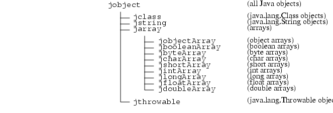
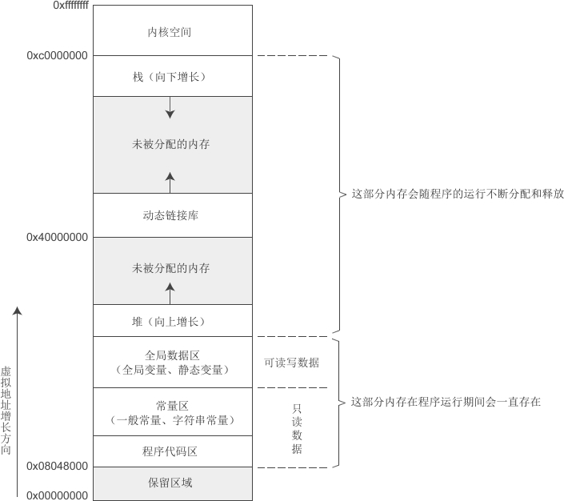

# JNI 编程指南

JNI相关内容：

+ JNIGI 

  Java Native Interface Golang Interface。

  可以实现 Java 和 GO 的互相调用。

> **Tips**：
>
> + JNI 编程和 Java 反射代码风格很像，类比反射学习JNI很容易适应JNI代码的编写。
> + 注意 JNI 函数名命名规范，从命名上很容易猜出函数的作用。


## JNI的作用

用于支持调用本地代码（本地代码个人理解应该是指的平台相关的代码，即系统本地提供的底层能力的接口等），通过调用本地代码克服一些内存管理、性能问题以及借用底层能力。

如果想从 Java 上层深入到 JVM 底层，甚至 Linux 底层，JNI是绕不过去的。

> 之前做Android驱动开发时，Android 设备 Service 和 底层 Linux 设备驱动全部是通过JNI连接的。

本Demo代码全部来自后面的资料。


## JNI工作原理

### 原理

暂时没找到实现原理相关资料。

不过从已有的资料看，**JNI的工作很简单就是作为Java和本地代码之间的桥梁，将Java调用转成本地调用**（单纯从使用上看跟RPC好像），包括：

Java调用本地方法时，将Java参数类型转成本地方法类型，执行本地方法后，将结果从本地类型转成Java类型返回；

其中可能还涉及一些语言差异而额外需要的操作，比如：

1）变量内存分配、释放

2）各种方法和数据类型的细节处理

3）引用管理

4）异常处理

5）附加本地线程

### 优缺点

优点：

+ 可以使用Java不提供的特殊的本地系统环境能力
+ 直接使用本地库高性能代码，降低性能损耗

缺点：

+ 程序不再跨平台（JDK自带的本地方法也是依赖不同平台的JVM, 或者说在每种平台上都有一套实现）
+ 程序不再绝对安全（本地代码的不当使用可能导致整个程序崩溃）

避免使用JNI的一些方法：

+ 比如使用TCP/IP、IPC等通信技术（这些本身也是要通过JNI调用实现，但是可以减少JNI的使用）

  比如数据库驱动JDBC API其实核心也是网络通信。


## JNI开发

### 开发环境搭建 & JNI调试配置

用的 IDEA + Clion CMake 的方式，搭建教程网上随便搜，主要是可能需要了解下CMake的使用，以及CMakeLists的编写。

> [CMake Tutorial](https://cmake.org/cmake/help/latest/guide/tutorial/index.html) (CMake官方文档)
>
> [CMake Cookbook中文版](https://www.bookstack.cn/books/CMake-Cookbook)
>
> [CMAKE TUTORIAL (YouTube)](https://www.youtube.com/playlist?list=PLalVdRk2RC6o5GHu618ARWh0VO0bFlif4)

配置CMake的时候遇到了个坑，就是本地环境变量明明配置了JAVA_HOME，但是 $ENV{JAVA_HOME} 的识别还是为空，最后只能手动再set一下。

```cmake
if(DEFINED ENV{JAVA_HOME})
    message("JAVA_HOME: $ENV{JAVA_HOME}")
else()
    message("NOT DEFINED JAVA_HOME VARIABLES")
    # TODO $ENV{JAVA_HOME} 已经配置了为何识别不到
    set(ENV{JAVA_HOME} "/usr/lib/jvm/java-1.8.0-openjdk-amd64")
endif()
# 引入JNI本地库编译依赖的头文件和库
set(JAVA_AWT_LIBRARY "$ENV{JAVA_HOME}/lib/amd64/libjawt.so")
set(JAVA_JVM_LIBRARY "$ENV{JAVA_HOME}/jre/lib/amd64/server/libjvm.so")
set(JAVA_INCLUDE_PATH "$ENV{JAVA_HOME}/include")
set(JAVA_INCLUDE_PATH2 "$ENV{JAVA_HOME}/include/linux")
set(JAVA_AWT_INCLUDE_PATH "$ENV{JAVA_HOME}/include")
```

调试的话，IDEA开启调试模式，然后将CLion调试器关联到Java进程即可（搜索 “Attach to Process ...”）。

一键生成本地方法头文件（External Tools配置）：

```tex
$JDKPath$/bin/javah
-jni -classpath $OutputPath$ -d ./jni $FileClass$
$ProjectFileDir$
```

### JNI开发流程

1. 创建一个 Java 类声明本地方法；

   ```java
   private native void sayHello();
   ```

2. 使用 javac 编译源文件，获取 class 文件，使用 javah -jni 指令生成 C 语言头文件，头文件包含本地方法函数原型；

   ```c
   JNIEXPORT void JNICALL Java_top_kwseeker_jni_hello_HelloJNI_sayHello
     (JNIEnv *, jobject);
   ```

3. 用 C/C++ 实现函数原型；

   ```c
   JNIEXPORT void JNICALL Java_top_kwseeker_jni_hello_HelloJNI_sayHello(JNIEnv *env, jobject obj) {
       printf("Hello JNI!\n");
   }
   ```

4. 编译 C/C++ 函数实现为本地库（Linux下是so文件，Window下是dll文件）；

5. 使用 System.loadLibrary() 加载本地库并执行。

   ```java
   System.loadLibrary("hello")
   ```

### JNI接口开发

#### JNI函数定义

```C
//					   Java_<.....Java调用者全限定类名......>_<方法名称> 
JNIEXPORT void JNICALL Java_top_kwseeker_jni_hello_HelloJNI_sayHello(JNIEnv *, jobject, ...);
// JNIEXPORT JNICALL 这两个宏确保函数在本地库外可见
// JNIEnv* 指向一个个函数表，函数表中每一个入口指向一个JNI函数，本地方法通过这些函数访问JVM中的数据结构
// jobject Java方法如果是非静态的就是this对象引用，否则是Java类引用
```

**数据类型映射**：

jni类型就是在jni头文件中定义的，对于基本类型的jni类型C/C++可以直接使用（看定义就能理解为何可以直接用了）。比如

```c
typedef int jint;
typedef signed char jbyte;
typedef unsigned char   jboolean;
typedef unsigned short  jchar;
typedef jint            jsize;
```

由于非基本类型传递到C/C++是指针类型，指针类型访问内部数据需要先知道数据结构，这里就需要使用函数表中的函数将jni非基本类型转成C/C++具体类型。

```c
struct _jobject;
typedef struct _jobject *jobject;	//抽象的结构体指针类型

typedef jobject jclass;
typedef jobject jthrowable;
typedef jobject jstring;
typedef jobject jarray;

typedef jarray jbooleanArray;
typedef jarray jbyteArray;
typedef jarray jcharArray;
typedef jarray jshortArray;
typedef jarray jintArray;
typedef jarray jlongArray;
typedef jarray jfloatArray;
typedef jarray jdoubleArray;
typedef jarray jobjectArray;
```



映射表：

| java    | jni header   | c/c++           | java                | jni header                                                   | c/c++           |
| ------- | ------------ | --------------- | ------------------- | ------------------------------------------------------------ | --------------- |
| int     | jint / jsize | jint (直接使用) | java.lang.Class     | jclass                                                       |                 |
| byte    | jbyte        | 同上            | java.lang.String    | jstring                                                      | char * / string |
| short   | jshort       | 同上            | java.lang.Throwable | jthrowable                                                   |                 |
| long    | jlong        | 同上            | T[]                 | jintArray, jbyteArray, jshortArray, <br />jlongArray, jfloatArray, jdoubleArray, jcharArray, jbooleanArray, jobjectArray | int[] ...       |
| float   | jfloat       | 同上            | Java.lang.Object    | jobject                                                      |                 |
| double  | jdouble      | 同上            |                     |                                                              |                 |
| char    | jchar        | 同上            |                     |                                                              |                 |
| boolean | jboolean     | 同上            |                     |                                                              |                 |

类型签名：

| Type Signature            | Java Type             |
| ------------------------- | --------------------- |
| Z                         | boolean               |
| B                         | byte                  |
| C                         | char                  |
| S                         | short                 |
| I                         | int                   |
| J                         | long                  |
| F                         | float                 |
| D                         | double                |
| L fully-qualified-class ; | fully-qualified-class |
| [ type                    | type[]                |
| ( arg-types ) ret-type    | method type           |

比如：`long f (int n, String s, int[] arr);` 的类型签名　`(ILjava/lang/String;[I)J `。

```java
long f (int n, String s, int[] arr);
	  ( I      Ljava/lang/String; [I ) J
```

#### 数据类型转换

Java传参进入到JNI先转成了"j"开头的数据类型，对于JNI基本数据类型C/C++可以直接使用，非基本类型需要转成C/C++类型；然后才能处理，处理完成后还要转回JNI数据类型，然后再转成Java本地方法返回类型。

相关的处理函数（都是函数指针）全部在 jni.h 中定义，但是没有搜到函数实现在哪里。

官网上关于这些函数的简单说明，参考 [JNI Functions](https://docs.oracle.com/javase/7/docs/technotes/guides/jni/spec/functions.html) 。

这些函数的使用方法感觉和反射有些像。

1. **字符串 jstring <---> char*/string**

   ```c
   // jni jstring -> c char*
   char *inCStr = (*env)->GetStringUTFChars(env, inJNIStr, NULL);	//返回指向字节数组的指针，以修改后的UTF-8编码表示。
   (*env)->ReleaseStringUTFChars(env, inJNIStr, inCStr);			//还要释放资源
   // c char* -> jni jstring
   jstring outJNIStr = (*env)->NewStringUTF(env, outCStr);
   ```

2. **数组**

   基本类型数组、对象数组。

   ```c
   // jintArray -> jint[]
   jint buf[10];
   (*env)->GetIntArrayRegion(env, array, 0, 10, buf);
   // jintArray -> jint*
   jint *cArr = (*env)->GetIntArrayElements(env, array, NULL);
   (*env)->ReleaseIntArrayElements(env, array, cArr, 2);
   
   //创建　jobjectArray
   jobjectArray result = (*env)->NewObjectArray(env, size, intArrCls, NULL);
   //创建　jintArray
   jintArray iArr = (*env)->NewIntArray(env, size);
   ```

#### 访问JVM字段和方法

访问实例字段、静态字段，调用实例方法、静态方法、父类实例方法、构造方法。

上面操作需要获取字段ID和方法ID，需要对其进行检索，检索操作可以使用缓存优化，降低性能损耗。

**缓存的方法：**

+ 全局变量

  ```c
  //使用全局变量缓存方法ID
  jmethodID MID_InstanceMethodCall_callback;
  jmethodID MID_StaticMethodCall_staticCallback;
  ```

+ 静态局部变量

  使用了C语言静态局部变量在函数执行完毕后不会释放，下次再进入这个函数维持上次函数结束时的值的特性。

  ```
  
  static jfieldID fid_s;
  ```

> C语言 全局变量、静态全局变量、静态局部变量的区别
>
> 全局变量的作用域是整个源程序；
>
> 静态全局变量的作用域是本源文件；
>
> 静态局部变量的作用域仍然是函数块，但是从原来的栈中存放改为静态存储区（下图的全局数据区静态变量）存放，函数退出数据也不会释放。
>
> 

**访问字段的函数**：

函数格式：

```c
//获取字段ID，好比java反射获取Field对象
jfieldID (JNICALL *GetFieldID)
    (JNIEnv *env, jclass clazz, const char *name, const char *sig);
//Getter
j<Type> (JNICALL *Get<JavaObject>Field)
    (JNIEnv *env, jobject obj, jfieldID fieldID);
//Setter
void (JNICALL *Set<JavaType>Field)
      (JNIEnv *env, jobject obj, jfieldID fieldID, j<Type> val);
```

**调用方法的函数**：

函数格式：

```C
//获取方法ID，好比java反射获取Method对象
jmethodID (JNICALL *GetStaticMethodID)
      (JNIEnv *env, jclass clazz, const char *name, const char *sig);
//调用方法
j<Type> (JNICALL *Call[Static][Nonvirtual]<JavaType>Method[V/A]) 
    (JNIEnv *env, jobject obj, jmethodID methodID, [.../va_list args/jvalue *args]);
// j<Type>				返回值类型， 比如：jlong
// [Static]				   表明是调用静态方法
// [Nonvirtual]		表明调用父类方法 
// <JavaType>， 比如：Double
// 三种传参方式：
// 1) ... 						动态参数
// 2) va_list args	
// 3) jvalue *args	联合体指针

//比如调用无参无返回值的方法的函数
void (JNICALL *CallVoidMethod)
    (JNIEnv *env, jobject obj, jmethodID methodID, ...);
void (JNICALL *CallVoidMethodV)
    (JNIEnv *env, jobject obj, jmethodID methodID, va_list args);
void (JNICALL *CallVoidMethodA)
    (JNIEnv *env, jobject obj, jmethodID methodID, const jvalue * args);    
```

#### JNI的三种引用

局部引用、全局引用、弱全局引用区别：

它们都属于JVM管理。

局部引用只在创建它的本地方法返回前有效；只在创建它的线程中有效，不可跨线程使用；本地方法返回后局部引用会自动释放；不能将局部引用保存到静态变量中缓存，一样会被释放，然后导致访问无效。

局部引用会阻止它所引用的对象被GC回收；

全局引用和弱全局引用，可以跨方法、跨线程使用，直到他被手动释放才失效；

全局引用会阻止它所引用的对象被GC回收；

弱全局引用不会阻止它所引用的对象被GC回收；

> 关于为何局部引用在本地方法返回后会被自动释放还要手动调用 DeleteLocalRef 释放？
>
> 官网举了个例子（使用大数组对象迭代）：
>
> **Note**: JDK/JRE 1.1 provides the `DeleteLocalRef` function above so that programmers can manually delete local references. For example, if native code iterates through a potentially large array of objects and uses one element in each iteration, it is a good practice to delete the local reference to the no-longer-used array element before a new local reference is created in the next iteration. As of JDK/JRE 1.2 an additional set of functions are provided for local reference lifetime management. They are the four functions listed below.

#### 异常检查与处理

异常检查

```c
jthrowable (JNICALL *ExceptionOccurred) (JNIEnv *env);
jboolean (JNICALL *ExceptionCheck) (JNIEnv *env);
```

打印异常和堆栈信息

```c
void (JNICALL *ExceptionDescribe) (JNIEnv *env);
```

清除异常信息

```c
 void (JNICALL *ExceptionClear) (JNIEnv *env);
```

将检测的异常再次抛出

```c
jint (JNICALL *Throw) (JNIEnv *env, jthrowable obj)
```

抛出指定类型的异常

```c
jint (JNICALL *ThrowNew) (JNIEnv *env, jclass clazz, const char *msg);
```

#### 调用接口

本地应用程序创建或链接JVM，调用Java接口。

看官网吧，[The Invocation API](https://docs.oracle.com/javase/7/docs/technotes/guides/jni/spec/invocation.html#wp15956) 。

#### JNI多线程


#### 简单封装已有的本地库

一对一映射、Shared Stubs、Peer传递数据结构。


### 使用JNI易错避坑指南


## 参考资料

+ [Java Native Interface Specification Contents](https://docs.oracle.com/en/java/javase/18/docs/specs/jni/)
+ [Java Programming Tutorial Java Native Interface (JNI)](https://www3.ntu.edu.sg/home/ehchua/programming/java/JavaNativeInterface.html)

+ 《JNI编程指南》
+ 《Java JNI 编程进阶》